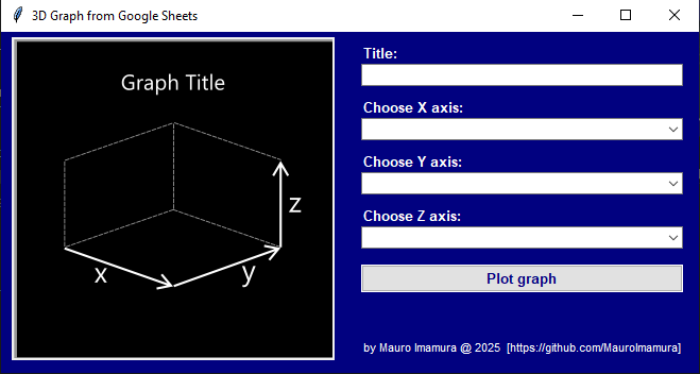
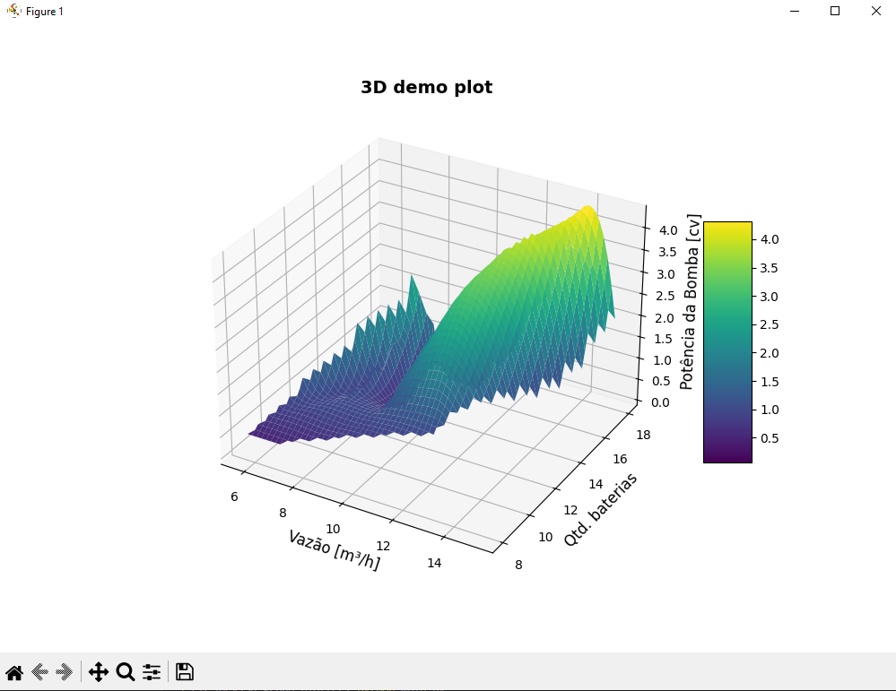

# Google Sheets 3D Graph Generator

This Python application generates 3D surface plots from data fetched directly from Google Sheets. It provides a user-friendly interface to select the X, Y, and Z axes from your spreadsheet columns and allows you to customize the plot title.

## Features

-   Fetches data directly from Google Sheets.
-   Generates 3D surface plots.
-   User-friendly interface for axis selection.
-   Customizable plot title.
-   Configuration via a JSON file (`config.json`).

## Prerequisites

-   Python 3.x
-   `pandas`
-   `numpy`
-   `matplotlib`
-   `scipy`
-   `tkinter`

## Setup and Installation

1.  **Clone the repository:**

    ```bash
    git clone https://github.com/MauroImamura/googlesheets-3dplotter.git
    cd googlesheets-3dplotter
    ```

2.  **Install the required Python packages:**

    ```bash
    pip install pandas numpy matplotlib scipy
    ```

3.  **Create a Google Sheet:**

    -   Create a Google Sheet containing your data.
    -   Ensure your sheet has at least three numeric columns.
    -   Make the sheet publicly accessible via a shareable link ("Anyone with the link can view").
    -   Obtain the sheet URL and the GID (sheet ID). The GID is the number at the end of the sheet URL after `gid=`.

4.  **Configure `config.json`:**

    -   Open the `config.json` file.
    -   Replace the empty `sheet_url` and `gid` values with your Google Sheet's URL and GID.
    -   Example:

        ```json
        {
          "sheet_url": "https://docs.google.com/spreadsheets/d/YOUR_SHEET_ID/export?format=csv&gid=",
          "gid": "YOUR_GID"
        }
        ```
        -   **Important:** The `sheet_url` must end with `export?format=csv&gid=`. The gid value must be only the number.

5.  **Run the application:**

    ```bash
    python main.py
    ```

## Usage

1.  After running the script, a window will appear.

    
2.  Enter a title for your graph in the "Título do Gráfico" field.
3.  Use the dropdown menus to select the columns for the X, Y, and Z axes.
4.  Click "Gerar Gráfico" to generate the 3D plot.

    

## Contributing

Contributions are welcome! To contribute:

1.  **Fork the repository.**
2.  **Create a new branch** for your feature or bug fix: `git checkout -b feature/your-feature-name`.
3.  **Make your changes** and commit them: `git commit -m "Add your feature"`.
4.  **Push your changes** to your fork: `git push origin feature/your-feature-name`.
5.  **Create a pull request** to the `main` branch of the original repository.

Please ensure your code follows the existing style and includes appropriate comments and documentation.

## Example Google Sheets URL

-   `https://docs.google.com/spreadsheets/d/YOUR_SHEET_ID/export?format=csv&gid=YOUR_GID`

## Dependencies

-   pandas
-   numpy
-   matplotlib
-   scipy
-   tkinter

## License

This project is licensed under the MIT License.