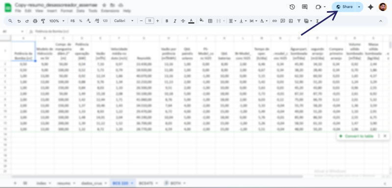
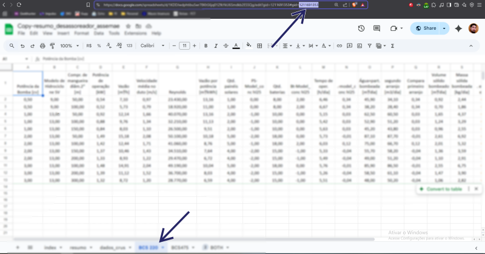
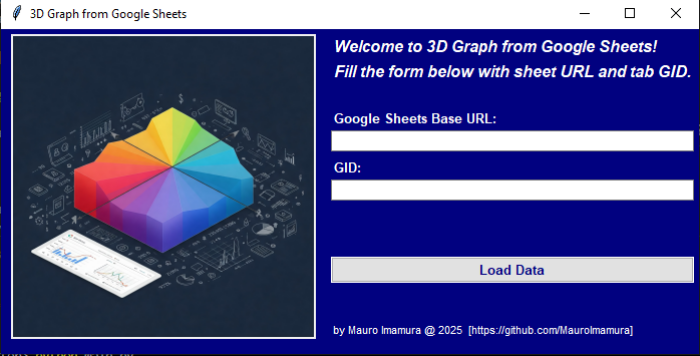

# Google Sheets 3D Graph Generator


This Python application generates 3D surface plots from data fetched directly from Google Sheets. It provides a user-friendly interface to select the X, Y, and Z axes from your spreadsheet columns and allows you to customize the plot title.

## 1. Features

-   Fetches data directly from Google Sheets.
-   Generates 3D surface plots.
-   User-friendly interface for axis selection.
-   Customizable plot title.
-   Configuration via a JSON file (`config.json`).

## 2. Prerequisites

-   `Python 3.x`
-   `pandas`
-   `numpy`
-   `matplotlib`
-   `scipy`
-   `tkinter`

## 3. Setup and Local Run

3.1.  **Clone the repository:**

    ```bash
    git clone https://github.com/MauroImamura/googlesheets-3dplotter.git
    cd googlesheets-3dplotter
    ```

3.2.  **Install the required Python packages:**

    ```bash
    pip install pandas numpy matplotlib scipy
    ```

3.3.  **Create a Google Sheet:**

    3.3.1.   Create a Google Sheet containing your data.

    3.3.2.   Ensure your sheet has at least three numeric columns.
    
    3.3.3.   Make the sheet publicly accessible via a shareable link ("Anyone with the link can view").
    
    3.3.4.   Obtain the sheet URL on Share button.
    
    
    
    3.3.5.   Get tab GID. It is available on sheet URL when you select the tab.
    

3.4.  **Run the application:**

    ```bash
    python main.py
    ```

## 4. Usage

4.1.  After running the script, this window will appear.
    

4.2.  Fill the form with sheet URL and GID from steps 3.3.4 and 3.3.5

4.3. Click on 'Load Data' and go to the next form.
    

4.4.  Enter a title for your graph in the "Title" field.

4.5.  Use the dropdown menus to select the columns for the X, Y, and Z axes.

4.6.  Click "Plot Graph" to generate the 3D plot.
    

## 5. Contributing

Contributions are welcome! To contribute:

5.1.  **Fork the repository.**
5.2.  **Create a new branch** for your feature or bug fix: `git checkout -b feature/your-feature-name`.
5.3.  **Make your changes** and commit them: `git commit -m "Add your feature"`.
5.4.  **Push your changes** to your fork: `git push origin feature/your-feature-name`.
5.5.  **Create a pull request** to the `main` branch of the original repository.

Please ensure your code follows the existing style and includes appropriate comments and documentation.

## 6. Google Sheets URL and tab GID examples

-   `https://docs.google.com/spreadsheets/d/SHEET-ID/edit?usp=sharing`
-   `https://docs.google.com/spreadsheets/d/SHEET-ID/edit?gid=TAB-GID#gid=TAB-GID`

## 7. Dependencies

-   pandas
-   numpy
-   matplotlib
-   scipy
-   tkinter

## 8. License

This project is licensed under the MIT License.